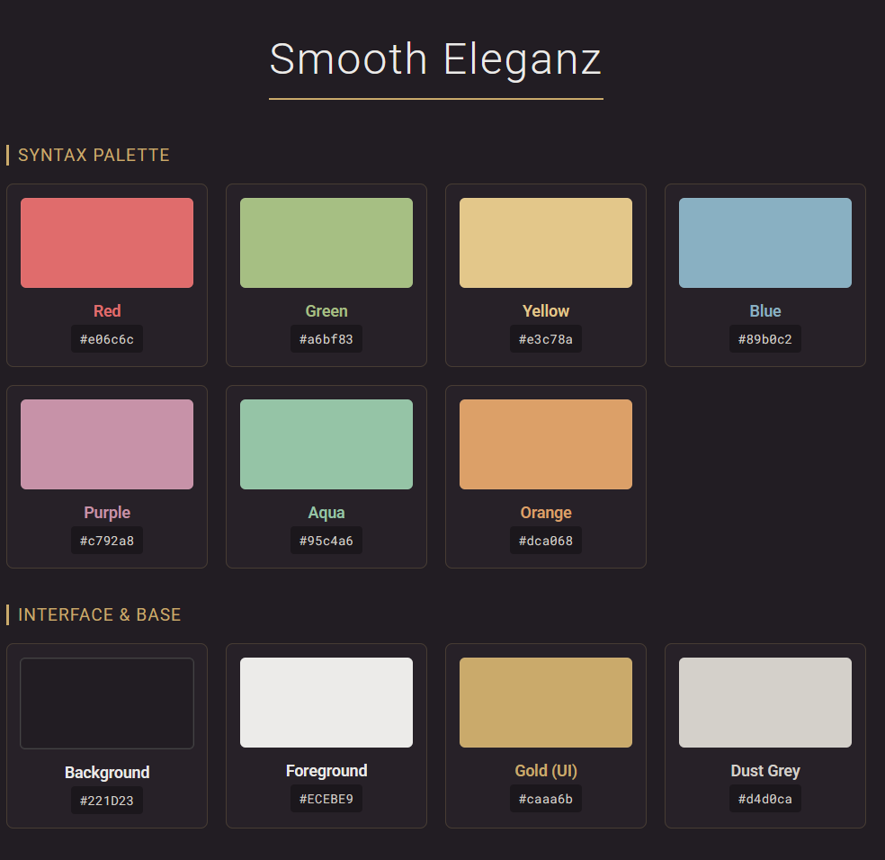

# The Smooth Eleganz Theme

For vs code

## About

this themes origin is a modified gruvbox theme, it started with me just playing with the colors using the default colors from gruvbox but with a changed background #171717 for a darker gruvbox look. After a while i adjusted the color saturation of the colorful elements in and moved to a cooler softer dark color with golden accents. i also moved away from the original text color to use my own that would fit the theme better.

It is also a flat theme without border in most places

### Version: 0.0.1

this is the first version of this theme and probably the only version of this theme unless something majorly breaks

**features:**

- visual studio code all encompassing color
- terminal color
- markdown preview color
- git color
